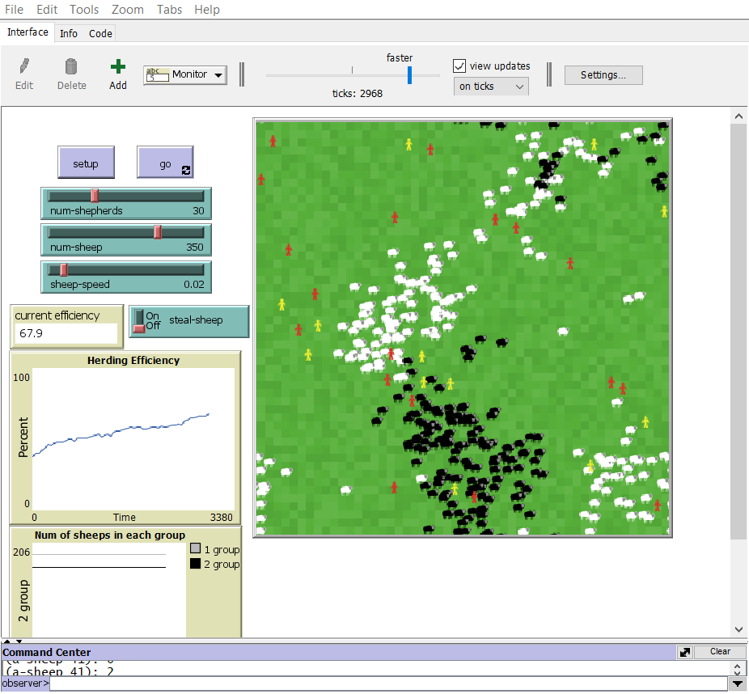
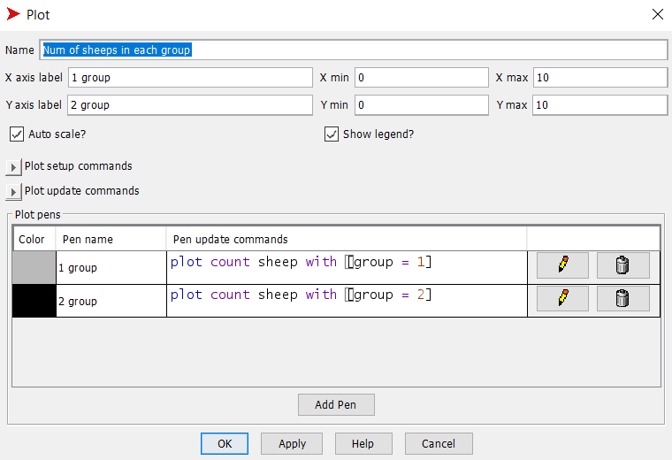
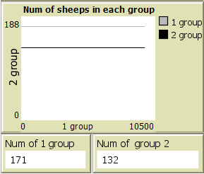
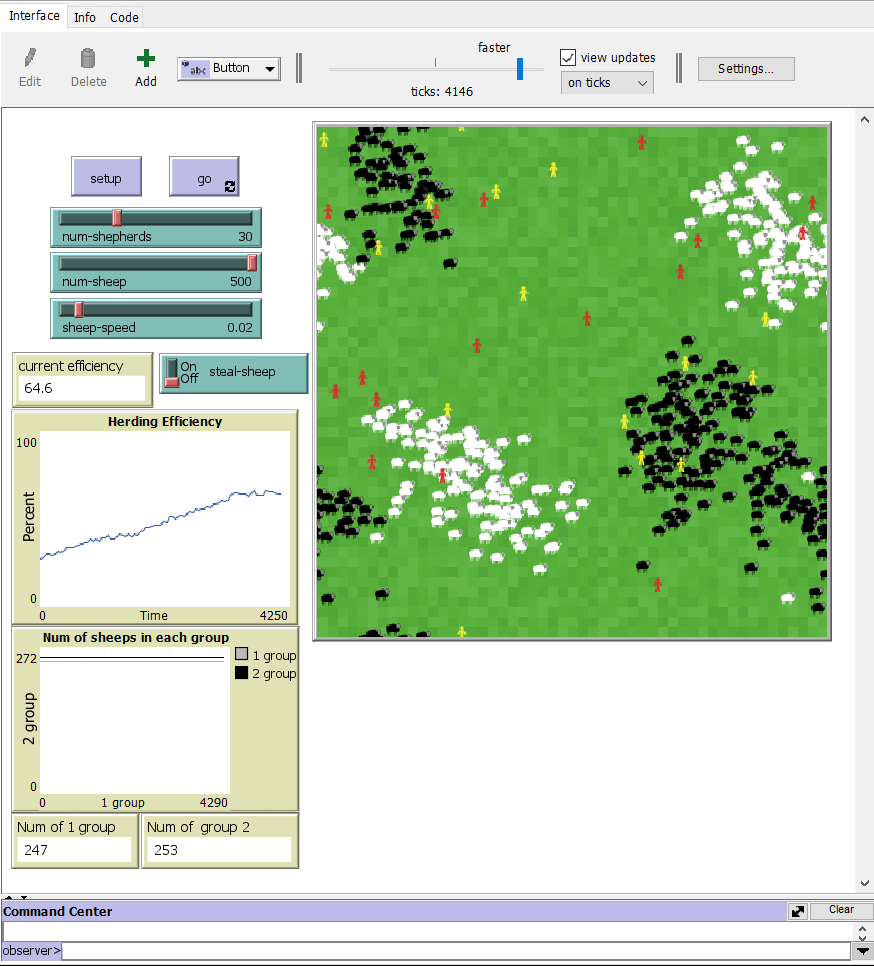
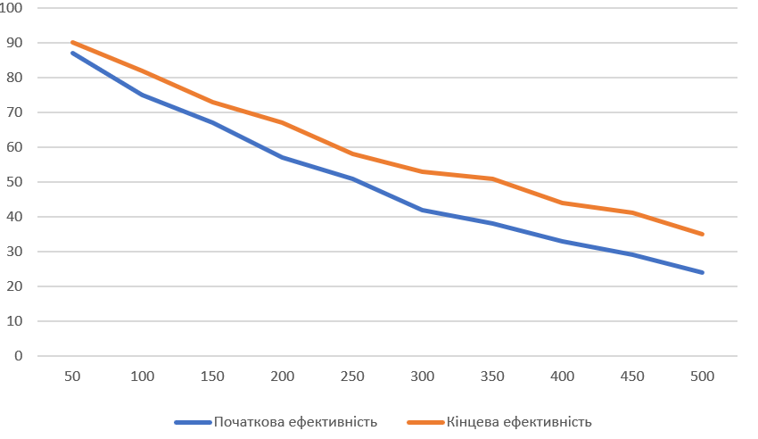

## Комп'ютерні системи імітаційного моделювання
## СПм-22-номер, **Сафанков Данило**
### Лабораторна робота №**2**. Редагування імітаційних моделей у середовищі NetLogo

### Варіант 9, модель у середовищі NetLogo:
[Sheperds](http://www.netlogoweb.org/launch#http://www.netlogoweb.org/assets/modelslib/Sample%20Models/Biology/Shepherds.nlogo)

 

### Внесені зміни у вихідну логіку моделі, за варіантом:

**Поділити овець на два різних стада, відповідно і пастухів на дві різні організації.** 

Пастухи повинні збирати тільки "своїх" овець.

Створено атрибут для овець та пастухів **group**, який відповідає за приналежність до першої чи другої групи (організації):
<pre>
  shepherds-own
[
  carried-sheep         ;; the sheep I'm carrying (or nobody if I'm not carrying in)
  found-herd?           ;; becomes true when I find a herd to drop it in
  group ; Властивість, що вказує на групу пастуха
]

sheep-own[
  group ; Властивість, що вказує на групу вівці
]

</pre>

Змінено процедуру **setup**. Тепер при запуску випадково визначається до якої групи відноситься вівця та пастух. Окрім того, тепер не змінюється колір пастухів, коли вони несуть вівцю. Ця особливість була видалена.
Також змін зазнали їхні основні кольори:
Вівці: група 1 - білі, група 2 - чорні.
Пастухи: група 1 - жовті, група 2 - червоні.
<pre>
  create-sheep num-sheep
  [ 
      set group one-of[1 2]
      ifelse group = 1 [ set color white] [ set color black ]
      set size 1.5  ;; easier to see
      setxy random-xcor random-ycor ]
  create-shepherds num-shepherds
  [ 
      set group one-of[1 2]
      ifelse group = 1 [ set color yellow] [ set color red ]
      set size 1.5  ;; easier to see
      set carried-sheep nobody
      set found-herd? false
      setxy random-xcor random-ycor ]
</pre>

Змінено **search-for-sheep** та **find-new-herd**. Тепер пастух обирає тільки ту вівцю, яка відповідає його групі. І "кладе" вівцю у стадо тільки поруч з вівцею тієї ж групи.
<pre>
  to search-for-sheep ;; shepherds procedure
  set carried-sheep one-of sheep-here with [not hidden? and group = [group] of myself]
 
  if (carried-sheep != nobody and group = [group] of carried-sheep)
    [
      ask carried-sheep
        [ hide-turtle ]  ;; make the sheep invisible to other shepherds
           ;; turn shepherd blue while carrying sheep
      fd 1 ]
end

to find-new-herd ;; shepherds procedure
  if any? sheep-here with [not hidden? and group = [group] of myself]
    [ set found-herd? true ]
end
</pre>

                  
**Додати відключаєму можливість збирати "чужих" вівець, які після потрапляння до нового стада змінюють свою приналежність.**
Додано відповідний *switch* **steal-sheep**:

І змінено поведінку пастухів, щоб вони реагували на зміни цієї кнопки:
<pre>
set carried-sheep one-of sheep-here with [(not hidden? and (group = [group] of myself or steal-sheep))]
</pre>

Також додано зміну кольору і групи, якщо відповідний *switch* увімкнено.
<pre>
 to find-empty-spot ;; shepherds procedure
  let shepherd-group group
  if all? sheep-here [hidden?]
    [ ask carried-sheep
        [
          show-turtle 
        if(steal-sheep)[ ;; ось тут ті зміни
          set group shepherd-group 
          ifelse group = 1 [ set color white] [ set color black ]     
        ]
      ]
      set carried-sheep nobody
      set found-herd? false
      rt random 360
      fd 20 ]
end
</pre>

### Внесені зміни у вихідну логіку моделі, на власний розсуд:

**Додано додаткові монітори та графік для відстеження динаміки груп**

**Змінено алгоритм вибору вівці пастухом**
  Відповідно до поточного написання моделі, кілька овець можуть займати одне фізичне місце. Всі пастухи шукають вівцю, яку можна забрати. Пастух може прийти в місце, де є кілька овець, і, оглянувши одну навмання, виявити, що інший пастух уже заволодів цією вівцею. І він піде далі проігнорувавши інших овець на цьому патчі. 
  Це було виправлено. Тепер пастух перевіряє всіх овець на патчі поки не знайде вільну, якщо вона є.

  <pre>
to search-for-sheep ;; shepherds procedure
  let suitable-sheep nobody
  ask sheep-here [
  if (not hidden? and (group = [group] of myself or steal-sheep)) [
    set suitable-sheep self
  ]
]
  if suitable-sheep != nobody [ set carried-sheep suitable-sheep] 
 
  if (carried-sheep != nobody)
    [
      ask carried-sheep
        [ hide-turtle ]  ;; make the sheep invisible to other shepherds
      fd 1
    ]
end

  </pre>

Фінальний код моделі та її інтерфейс доступні за [посиланням](Shepherds_better.nlogo). 
 
  
## Обчислювальні експерименти
### 1. Вплив кількості овець на ефективність випасання
Досліджується залежність кількості овець на ефективність випасання пастухами через 500 тактів.
Експерименти проводяться при 50-500 овець, з кроком 50, усього 10 симуляцій.  
Інші керуючі параметри мають значення за замовчуванням:
- **num-shepherds**: 30
- **sheep-speed**: 0.02
  **steal-sheep**: off

<table>
<thead>
<tr><th>Кількість овець</th><th>Початкова ефективність</th><th>Кінцева ефективність</th></tr>
</thead>
<tbody>
<tr><td>50</td><td>87</td><td>90</td></tr>
<tr><td>100</td><td>75</td><td>82</td></tr>
<tr><td>150</td><td>67</td><td>73</td></tr>
<tr><td>200</td><td>57</td><td>67</td></tr>
<tr><td>250</td><td>52</td><td>58</td></tr>
<tr><td>300</td><td>42</td><td>53</td></tr>
<tr><td>350</td><td>38</td><td>51</td></tr>
<tr><td>400</td><td>33</td><td>44</td></tr>
<tr><td>450</td><td>29</td><td>41</td></tr>
<tr><td>500</td><td>24</td><td>35</td></tr>
</tbody>
</table>

- Як і подібний експеремент з минулої лабораторної, цей підтверджує, що збільшення кількості овець призводить до зменшення ефективності випасання через більшу розкиданість стада та потребу в більших зусиллях для управління ними.
- Проте в данному експерименті цей ефект більш виражений, що може бути пов'язано з тим, що тепер пастухам потрібно "сортувати" овець на своїх та чужих і пасти їх в різних стадах, що забирає додаткові сили та час.
